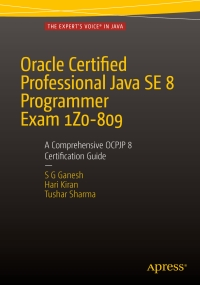

# Apress Source Code

This repository accompanies [*Oracle Certified Professional Java SE 8 Programmer Exam 1Z0-809: A Comprehensive OCPJP 8 Certification Guide*](http://www.apress.com/9781484218358) by SG Ganesh, Hari Kiran Kumar, and Tushar Sharma (Apress, 2016).

[comment]: #cover

Download the files as a zip using the green button, or clone the repository to your machine using Git.

## Releases

Release v1.0 corresponds to the code in the published book, without corrections or updates.

## Contributions

See the file Contributing.md for more information on how you can contribute to this repository.
